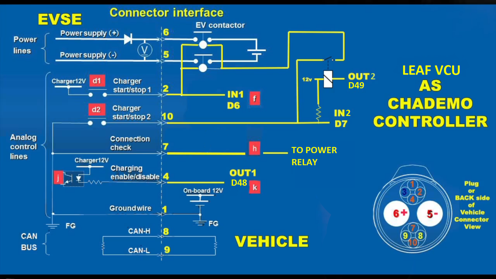

# CHAdeMOSoftware
Software for Damien Maguire's CHAdeMO controller: https://github.com/damienmaguire/Chademo-Fast-Charge-Controller
This code will help you add CHAdeMO DC fast charging to your EV, whether it is OEM or DIY.

# Required hardware 
- CHAdeMO connector  
- 2x contactors  
- Leaf VCU https://evbmw.com/index.php/evbmw-webshop/nissan-built-and-tested-boards/leaf-inverter-controller-fully-built-and-tested (new hardware is being designed and built, coming soon).  
- Relay  
- 1k pullup resistor   
- Isabellenhutte IVT or IVT-S shunt

# Required software
- This code
- SimpleISA library https://github.com/Isaac96/SimpleISA
- due_can library https://github.com/collin80/due_can
- due_wire library https://github.com/collin80/due_wire
- DueTimer library https://github.com/ivanseidel/DueTimer
- Wire_EEPROM library https://github.com/collin80/Wire_EEPROM  

# Schematic
  

# Notes
- I am open to adding support for different CAN-bus BMS systems, and possibly different voltage and current sensors. If you want something added please at least send me the entire protocol.  
- The Leaf VCU requires a single modification to function correctly. Because its inputs are protected by voltage dividers, R17 (pulldown for IN2/D7) must be removed.    
- If you don't have a Leaf VCU or don't want to dish out 300 euros, you can use a standard Due. You will need an M24M02 EEPROM, two open collector outputs, and two 12V-tolerant inputs, as well as dual CAN transceivers.

# As of August 28, this code is in beta testing. In any case, use at your own risk - it is provided as-is.   
Development is occurring on OpenInverter https://openinverter.org/forum/viewtopic.php?p=15918#p15918  
